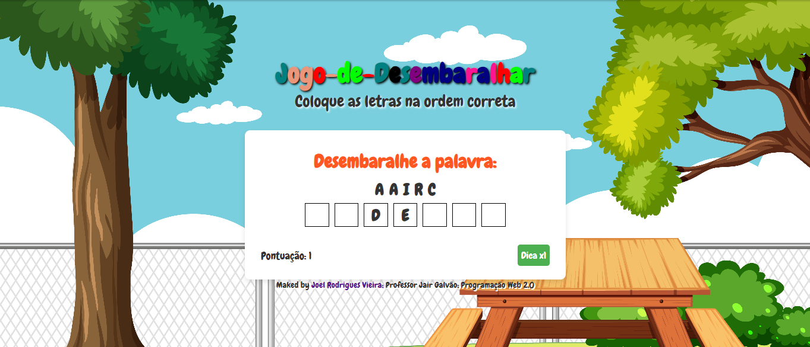

# Jogo de Desembaralhar Palavras

Bem-vindo ao Jogo de Desembaralhar Palavras! Este é um jogo divertido onde você deve arrastar as letras embaralhadas para formar a palavra correta.

## Como Jogar

1. As letras de uma palavra serão apresentadas em uma ordem embaralhada.
2. Arraste as letras para os quadrados correspondentes.
3. Utilize as dicas disponíveis para ajudar na formação da palavra.
4. Tente completar o jogo antes que suas dicas acabem!

## Regras

- Você começa com 3 dicas.
- Cada vez que você usar uma dica, uma letra será colocada no lugar correto.
- Se você não tiver mais dicas, não poderá obter mais.
- Tente acertar a palavra correta para ganhar pontos!

## Tecnologias Utilizadas

- HTML
- CSS
- JavaScript

## Contribuições

Se você tiver sugestões ou melhorias, sinta-se à vontade para abrir uma issue ou enviar um pull request.

## Licença

Este projeto está licenciado sob a [Licença MIT](LICENSE).
